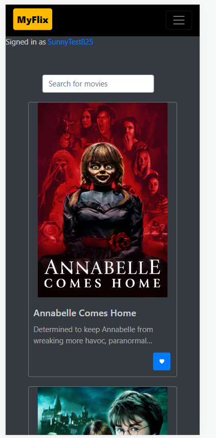
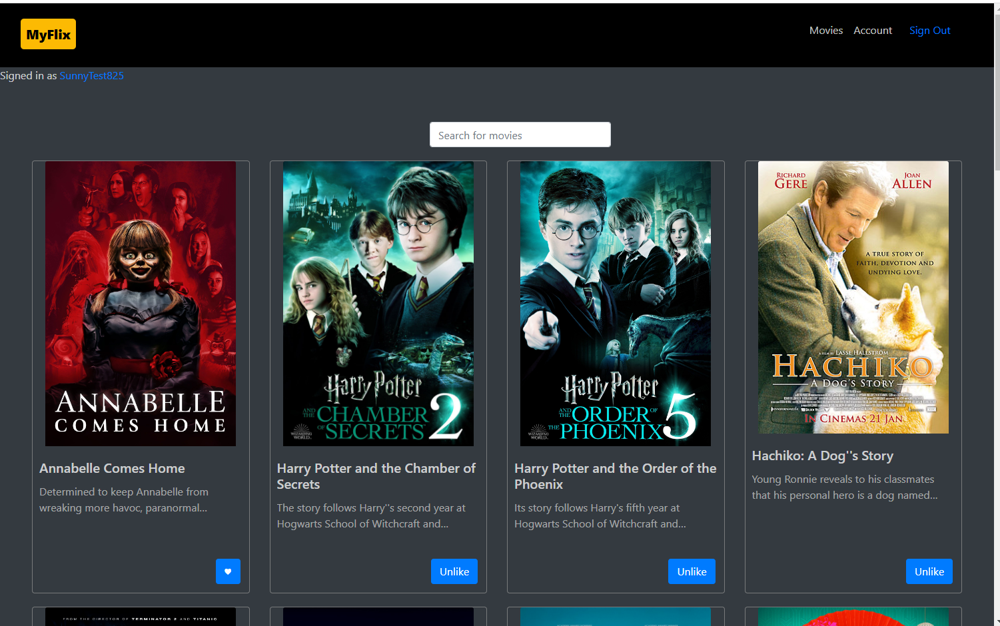

# myFlix-client

This is a client side solution to the MyFlix project.

## Table of contents

- [Overview](#overview)
  - [The challenge](#the-challenge)
  - [Screenshot](#screenshot)
  - [Links](#links)
  - [Built with](#built-with)
  - [Continued development](#continued-development)
- [Author](#author)

## Overview

Using React, build the client-side for an application called myFlix based on
its existing server-side code (REST API and database).

### The challenge

● As a user, I want to be able to access information on movies, directors, and genres so that I
can learn more about movies I’ve watched or am interested in.
● As a user, I want to be able to create a profile so I can save data about my favorite movies.

### Screenshot

### Links

- Solution URL: [https://github.com/sunnyyuanz/myFlix-client]
- Live Site URL: [https://thebestmyflix.netlify.app/]

### Built with

- SPA
- React
- Redux
- Bootstrap
- Javascript

### Continued development

Upload new movies is still a headache for admins. For future developer, it will have an UI just for admin person to upload new movies.

## Author

- Website - [SunnyZ](https://github.com/sunnyyuanz)
